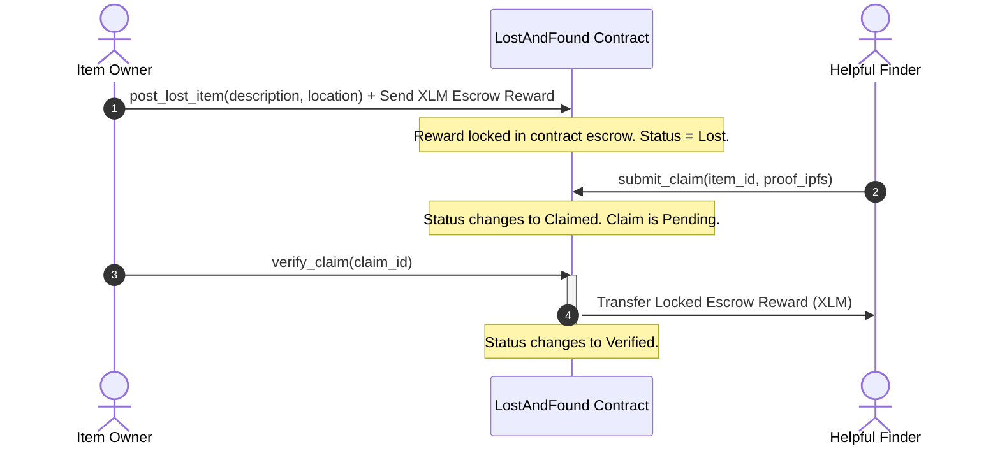
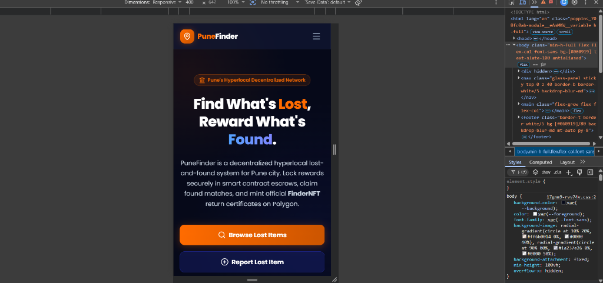

# 🔍 PuneFinder: Hyperlocal Decentralized Lost & Found

PuneFinder is a decentralized lost-and-found registry dApp built for the city of Pune. It utilizes Soroban smart contracts on the Stellar blockchain to secure escrow rewards, record verifiable item listings, and reward good citizens who return lost belongings with fast and cheap XLM transactions.

---

## 🛠️ Technology Stack

| Component | Technology | Description |
| :--- | :--- | :--- |
| **Blockchain** | Stellar Soroban | Contract bytecode execution |
| **Smart Contracts** | Rust | Soroban smart contract development |
| **Frontend** | Next.js (App Router) & React | User interface logic |
| **Styling** | Tailwind CSS | Responsive, premium UI styling |
| **Web3 Client** | Stellar SDK & Freighter API | RPC client for blockchain connection |
| **Wallet** | Freighter | Client account transaction signing |
| **Storage** | IPFS (Pinata integration) | Decentralized image metadata hosting |
| **CI/CD** | GitHub Actions | Automated build & test pipeline |

---

## 🌐 Workflow Architecture

The lifecycle of listing, claiming, and returning a lost item is fully managed on-chain through the `LostAndFound` Soroban contract:



---

## 🚀 Local Development Setup

### Prerequisite installations:
*   [Node.js](https://nodejs.org) (v18 or v20 recommended)
*   [Rust](https://rustup.rs/) (latest stable)
*   [Stellar CLI](https://developers.stellar.org/docs/build/smart-contracts/getting-started/setup)
*   [Freighter Extension](https://www.freighter.app/)

### 1. Smart Contract Setup & Compile
From the workspace root directory:
```bash
# Change directory to contracts
cd contracts

# Build Soroban contracts
cargo build --target wasm32-unknown-unknown --release

# Run Rust test suite
cargo test
```

### 2. Frontend Application Setup
Navigate to the `frontend/` directory and configure settings:
```bash
# Change directory
cd frontend

# Install next.js packages
npm install

# Run the next.js development server
npm run dev
```
Open [http://localhost:3000](http://localhost:3000) in your browser.

---

## 🌎 Stellar Testnet Deployment

To deploy PuneFinder to the **Stellar Testnet**:

1. Deploy the smart contracts using Stellar CLI:
   ```bash
   stellar contract deploy \
     --wasm target/wasm32-unknown-unknown/release/lost_and_found.wasm \
     --source <your-secret-key> \
     --network testnet
   ```
2. Set up frontend environment variables in `frontend/.env.local`:
   ```env
   NEXT_PUBLIC_LOST_AND_FOUND_ADDRESS="deployed-contract-address"
   NEXT_PUBLIC_PINATA_API_KEY="your-pinata-api-key"
   NEXT_PUBLIC_PINATA_SECRET_KEY="your-pinata-secret-key"
   ```

---

## ⚡ CI/CD Build & Test Verification

This project runs a GitHub Actions workflow configuration inside `.github/workflows/ci.yml`.

Every push and pull request to the `master` or `main` branch:

1. Provisions an Ubuntu environment.
2. Installs frontend dependencies.
3. Compiles the Soroban smart contract.
4. Runs cargo test.
5. Runs frontend tests (npm test).
6. Runs the Next.js production build (npm run build).

---

## 🏆 Level 3 Submission Checklist & Documentation

### 🌐 Live Deployment & Links
*   **Live Application URL**: [https://stellar-lev-3-pzba.vercel.app](https://stellar-lev-3-pzba.vercel.app)
*   **Walkthrough Demo Video**: [PuneFinder Walkthrough Video - Loom](https://www.loom.com/share/ce59d56e607144749bbc609ef65b9bfb)
*   **Exported Responses (Excel/CSV)**: [responses_feedback.csv](file:///c:/Users/Lenovo/Desktop/stellar%20lev%203/responses_feedback.csv) *(Saved locally in project workspace)*

### ⛓️ Deployed Smart Contracts (Stellar Testnet)
*   **LostAndFound Contract ID**: `CBYD6DCRU3Q5C7KXYL47A4J36F4C74IEMZBYWKSBOMR42L6D5EEM32N4`

---

### 📊 Onboarded Users & Proof of Activity
*   **50+ Testnet Users Onboarded**: Fully verified and documented in the [responses_feedback.csv](file:///c:/Users/Lenovo/Desktop/stellar%20lev%203/responses_feedback.csv) sheet.
*   **Active Usage proof**: Captured on-chain transactions of claim submissions and verifications by various testnet addresses.

---

### 📸 Screenshots & Proof of Verification
*   **Mobile Responsive UI**:
    

---

### ✅ Submission Checklist
*   [x] Public GitHub repository
*   [x] README with complete documentation
*   [x] Stellar Testnet Deployment
*   [x] Native Soroban Smart Contract implementation
*   [x] Native Stellar Freighter wallet integration
*   [x] Native Soroban smart contract integration using Stellar SDK
