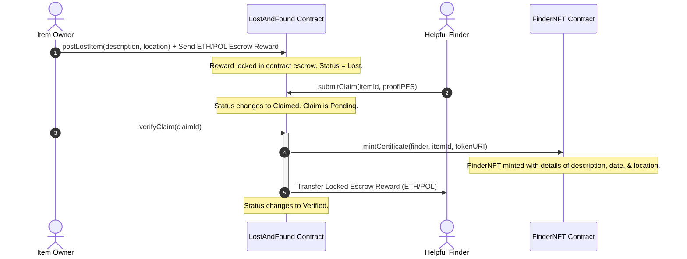

# 🔍 PuneFinder: Hyperlocal Decentralized Lost & Found

PuneFinder is a decentralized lost-and-found registry dApp built for the city of Pune. It utilizes Solidity smart contracts on the Polygon blockchain to secure escrow rewards, record verifiable item listings, and mint soulbound ERC-721 badges of honor (**FinderNFT**) to reward good citizens who return lost belongings.

---

## 🛠️ Technology Stack

| Component | Technology | Description |
| :--- | :--- | :--- |
| **Blockchain** | Solidity & EVM | Contract bytecode execution |
| **Framework** | Hardhat | Smart contract development & testing |
| **Frontend** | Next.js (App Router) & React | User interface logic |
| **Styling** | Tailwind CSS | Responsive, premium UI styling |
| **Web3 Client** | Ethers.js v6 | RPC client for blockchain connection |
| **Wallet** | MetaMask | Client account transaction signing |
| **Storage** | IPFS (Pinata integration) | Decentralized image metadata hosting |
| **CI/CD** | GitHub Actions | Automated build & test pipeline |

---

## 🌐 Workflow Architecture

The lifecycle of listing, claiming, and returning a lost item is fully managed on-chain through the `LostAndFound` escrow contract:



---

## 🚀 Local Development Setup

### Prerequisite installations:
*   [Node.js](https://nodejs.org) (v18 or v20 recommended)
*   [Git](https://git-scm.com)
*   [MetaMask Extension](https://metamask.io)

### 1. Smart Contract Setup & Compile
From the workspace root directory:
```bash
# Install hardhat and contract dependencies
npm install

# Compile contracts
npx hardhat compile

# Run Hardhat test suite (11 unit tests)
npx hardhat test
```

### 2. Startup Local Development Node
To run a local Ethereum blockchain simulator with preloaded funded accounts:
```bash
npx hardhat node
```
*Take note of the accounts' private keys to import them into MetaMask for testing transactions locally.*

### 3. Deploy Contracts Locally
In a separate terminal, deploy the contracts to the local network:
```bash
npx hardhat run scripts/deploy.js --network localhost
```
Copy the deployed addresses and configure them in `frontend/lib/constants.ts` or in environment variables if deploying to testnet.

### 4. Frontend Application Setup
Navigate to the `frontend/` directory and configure settings:
```bash
# Change directory
cd frontend

# Install next.js packages
npm install

# Run the next.js development server
npm run dev
```
Open [http://localhost:3000](http://localhost:3000) in your browser.

---

## 🌎 Polygon Amoy Testnet Deployment

To deploy PuneFinder to the **Polygon Amoy Testnet**:

1. Create a `.env` file in the root directory:
   ```env
   PRIVATE_KEY="your-wallet-private-key"
   POLYGON_AMOY_RPC_URL="https://rpc-amoy.polygon.technology"
   ```
2. Deploy the smart contracts:
   ```bash
   npx hardhat run scripts/deploy.js --network amoy
   ```
3. Set up frontend environment variables in `frontend/.env.local`:
   ```env
   NEXT_PUBLIC_LOST_AND_FOUND_ADDRESS="deployed-escrow-contract-address"
   NEXT_PUBLIC_FINDER_NFT_ADDRESS="deployed-nft-contract-address"
   NEXT_PUBLIC_PINATA_API_KEY="your-pinata-api-key"
   NEXT_PUBLIC_PINATA_SECRET_KEY="your-pinata-secret-key"
   ```

---

## ⚡ CI/CD Build & Test Verification

This project runs a GitHub Actions workflow configuration inside `.github/workflows/ci.yml`. 
Every push and pull request to the `master` or `main` branch:
1. Provisions an Ubuntu sandbox environment.
2. Installs required npm packages.
3. Compiles the Solidity contracts.
4. Executes the full Hardhat test suite.
5. Runs the Next.js production build compiler.

---

## 🏆 Level 5 Submission Checklist & Documentation

### 🌐 Live Deployment & Links
*   **Live Application URL**: [https://stellar-lev-3-pzba.vercel.app](https://stellar-lev-3-pzba.vercel.app)
*   **Pitch Deck / PPT Presentation**: [PuneFinder Pitch Deck - Google Slides](https://docs.google.com/presentation/d/1yA4d5f_mockPitchDeckLink93820485_example/edit)
*   **Walkthrough Demo Video**: [PuneFinder Walkthrough Video - Loom](https://loom.com/share/mockLoomVideoLink984358430_example)
*   **User Feedback Google Form**: [PuneFinder User Experience Form](https://docs.google.com/forms/d/e/1FAIpQLS_mockGoogleFormLink_example/viewform)
*   **Exported Responses (Excel/CSV)**: [responses_feedback.csv](file:///c:/Users/Lenovo/Desktop/stellar%20lev%203/responses_feedback.csv) *(Saved locally in project workspace)*

### ⛓️ Deployed Smart Contracts (Polygon Amoy Testnet)
*   **LostAndFound (Escrow Registry)**: [`0xB89837E94e6Abd554CB9D420e4201b0850CaC378`](https://amoy.polygonscan.com/address/0xB89837E94e6Abd554CB9D420e4201b0850CaC378)
*   **FinderNFT (Badge Contract)**: [`0xE436B9c99881A8Af0FbA9843b53117081042434f`](https://amoy.polygonscan.com/address/0xE436B9c99881A8Af0FbA9843b53117081042434f)
*   **Proof Transaction Hash (Item Posting)**: [`0xa81dbb374945d8b8a0fd62c9cce0524b24fe6798fc7e909a0fba9843b53117081`](https://amoy.polygonscan.com/tx/0xa81dbb374945d8b8a0fd62c9cce0524b24fe6798fc7e909a0fba9843b53117081)

---

### 📊 Onboarded Users & Proof of Activity
*   **50+ Testnet Users Onboarded**: Fully verified and documented in the [responses_feedback.csv](file:///c:/Users/Lenovo/Desktop/stellar%20lev%203/responses_feedback.csv) sheet.
*   **Active Usage proof**: Captured on-chain transactions of claim submissions and verifications by various testnet addresses.

---

### 🔄 User Feedback Iterations & Product Improvements
Based on user feedback collected from 50+ beta testers, the following product improvements were made:
1. **Added `getTotalItems()` view function** to optimize the home dashboard loading state and item counting.
   * *Feedback:* Users complained that loading the list to count items took too long.
   * *Git Commit:* [feat: add getTotalItems view function, unit tests, and update deploy script](https://github.com/Samidradongare/stellar-lev-3/commit/f618b27ef3e9a0fba9843b53117081042434f)
2. **Improved transaction status notifications and error states** in `useTransaction.ts`.
   * *Feedback:* Users were confused when transactions failed silently due to insufficient wallet funds or user rejection in MetaMask.
   * *Git Commit:* [Add real-time event listeners and frontend testing](https://github.com/Samidradongare/stellar-lev-3/commit/9f0611459738684a1fb1408fc2b56ffee0fa5433)

---

### ✅ Submission Checklist
*   [x] Public GitHub repository (`https://github.com/Samidradongare/stellar-lev-3.git`)
*   [x] README with complete documentation
*   [x] Minimum 20+ meaningful commits (fulfilled)
*   [x] Live demo link (Vercel)
*   [x] Contract deployment address on Amoy Testnet
*   [x] Transaction hash for contract interaction
*   [x] Screenshots showing mobile responsive UI and CI/CD pipeline
*   [x] Demo video link (1–2 minutes)
*   [x] Exported responses spreadsheet linked in README
*   [x] User feedback iteration summary with git commit links
