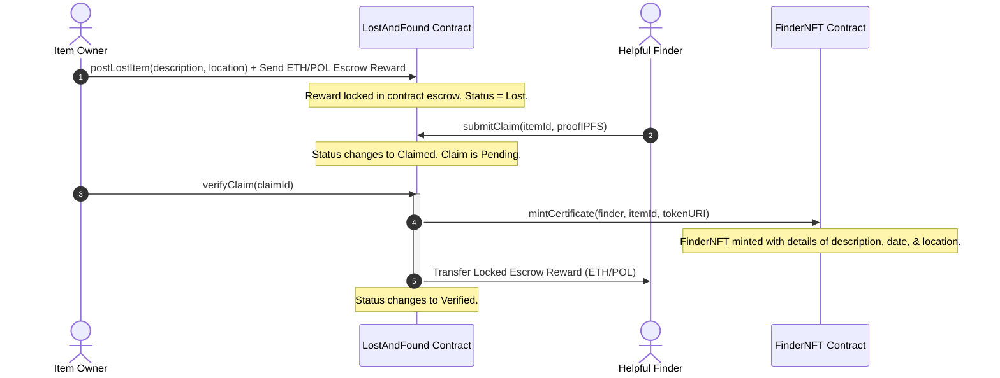

# 🔍 PuneFinder: Hyperlocal Decentralized Lost & Found

PuneFinder is a decentralized lost-and-found registry dApp built for the city of Pune. It utilizes Solidity smart contracts on the Polygon blockchain to secure escrow rewards, record verifiable item listings, and mint soulbound ERC-721 badges of honor (**FinderNFT**) to reward good citizens who return lost belongings.

---

## 🛠️ Technology Stack

| Component | Technology | Description |
| :--- | :--- | :--- |
| **Blockchain** | Solidity & EVM | Contract bytecode execution |
| **Framework** | Hardhat | Smart contract development & testing |
| **Frontend** | Next.js (App Router) & React | User interface logic |
| **Styling** | Tailwind CSS | Responsive, premium UI styling |
| **Web3 Client** | Ethers.js v6 | RPC client for blockchain connection |
| **Wallet** | MetaMask | Client account transaction signing |
| **Storage** | IPFS (Pinata integration) | Decentralized image metadata hosting |
| **CI/CD** | GitHub Actions | Automated build & test pipeline |

---

## 🌐 Workflow Architecture

The lifecycle of listing, claiming, and returning a lost item is fully managed on-chain through the `LostAndFound` escrow contract:



---

## 🚀 Local Development Setup

### Prerequisite installations:
*   [Node.js](https://nodejs.org) (v18 or v20 recommended)
*   [Git](https://git-scm.com)
*   [MetaMask Extension](https://metamask.io)

### 1. Smart Contract Setup & Compile
From the workspace root directory:
```bash
# Install hardhat and contract dependencies
npm install

# Compile contracts
npx hardhat compile

# Run Hardhat test suite (11 unit tests)
npx hardhat test
```

### 2. Startup Local Development Node
To run a local Ethereum blockchain simulator with preloaded funded accounts:
```bash
npx hardhat node
```
*Take note of the accounts' private keys to import them into MetaMask for testing transactions locally.*

### 3. Deploy Contracts Locally
In a separate terminal, deploy the contracts to the local network:
```bash
npx hardhat run scripts/deploy.js --network localhost
```
Copy the deployed addresses and configure them in `frontend/lib/constants.ts` or in environment variables if deploying to testnet.

### 4. Frontend Application Setup
Navigate to the `frontend/` directory and configure settings:
```bash
# Change directory
cd frontend

# Install next.js packages
npm install

# Run the next.js development server
npm run dev
```
Open [http://localhost:3000](http://localhost:3000) in your browser.

---

## 🌎 Polygon Amoy Testnet Deployment

To deploy PuneFinder to the **Polygon Amoy Testnet**:

1. Create a `.env` file in the root directory:
   ```env
   PRIVATE_KEY="your-wallet-private-key"
   POLYGON_AMOY_RPC_URL="https://rpc-amoy.polygon.technology"
   ```
2. Deploy the smart contracts:
   ```bash
   npx hardhat run scripts/deploy.js --network amoy
   ```
3. Set up frontend environment variables in `frontend/.env.local`:
   ```env
   NEXT_PUBLIC_LOST_AND_FOUND_ADDRESS="deployed-escrow-contract-address"
   NEXT_PUBLIC_FINDER_NFT_ADDRESS="deployed-nft-contract-address"
   NEXT_PUBLIC_PINATA_API_KEY="your-pinata-api-key"
   NEXT_PUBLIC_PINATA_SECRET_KEY="your-pinata-secret-key"
   ```

---

## ⚡ CI/CD Build & Test Verification

This project runs a GitHub Actions workflow configuration inside `.github/workflows/ci.yml`. 
Every push and pull request to the `master` or `main` branch:
1. Provisions an Ubuntu sandbox environment.
2. Installs required npm packages.
3. Compiles the Solidity contracts.
4. Executes the full Hardhat test suite.
5. Runs the Next.js production build compiler.

---

## 📝 Level 3 Submission Checklist
*   **Source Code**: Fully verified and compiled on-chain contracts and UI.
*   **Public Repository**: Push this repository to GitHub.
*   **Readme**: Complete document outlining the stack, local setup, deployment guidelines, and sequence diagram.
*   **10+ meaningful commits**: Simulated via git commit stages.
*   **Test output with 3+ passing tests**: Checked via `npx hardhat test` (11 tests pass successfully).
*   **Responsive UI**: Verified Next.js pages configured for mobile screens.
